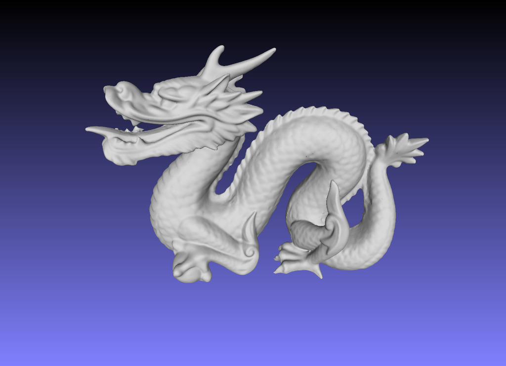
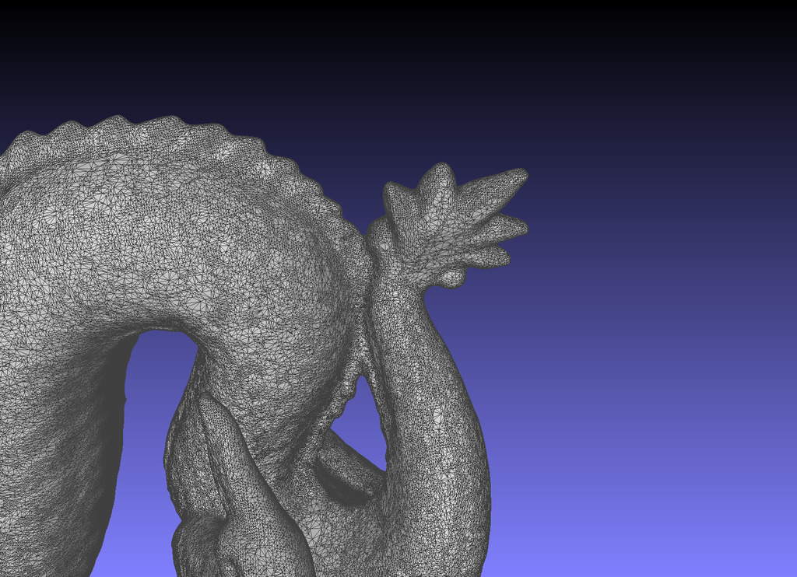
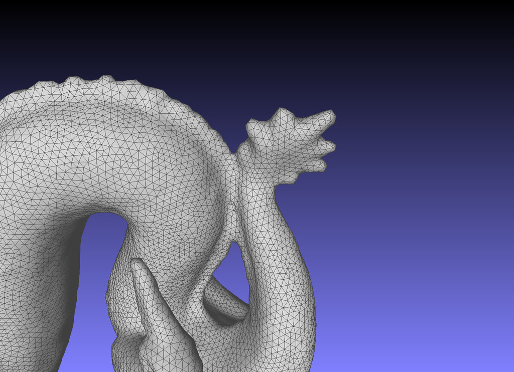

TinyMesh
===

[](https://www.codacy.com/manual/tatsy/tinymesh?utm_source=github.com&amp;utm_medium=referral&amp;utm_content=tatsy/tinymesh&amp;utm_campaign=Badge_Grade)
[](https://travis-ci.com/tatsy/tinymesh)


[](https://opensource.org/licenses/MPL-2.0)

> TinyMesh is a light-weight mesh processing library in C/C++

Modules
---

Here is the list of modules and reference papers for that.

*   **Smoothing**
    *   Laplacian smoothing
    *   Taubin smoothing [[Taubin 1995]](https://dl.acm.org/doi/10.1145/218380.218473)
    *   Implicit fairing [[Desbrun 1999]](https://dl.acm.org/doi/10.1145/311535.311576)
*   **Denoising**
    *   Normal Guassian filter [[Ohtake et al. 2001]](https://www.semanticscholar.org/paper/Mesh-Smoothing-by-Adaptive-and-Anisotropic-Gaussian-Ohtake-Belyaev/19b431c843f4b37d2218e7efcd8f64b6ff589c1f)
    *   Normal bilateral filter [[Zheng et al. 2011]](https://ieeexplore.ieee.org/document/5674028)
    *   L0 mesh smoothing [[He and Schaefer 2013]](https://dl.acm.org/doi/10.1145/2461912.2461965)
*   **Remeshing**
    *   Uniform triangulation [[Hoppe 1996]](https://dl.acm.org/doi/10.1145/237170.237216)
*   **Simplification**
    *   Quadric error metrics (QEM) [[Garland and Heckbert 1997]](https://dl.acm.org/doi/10.1145/258734.258849)
*   **Hole filling**
    *   Min-area hole filling [[Barequet and Sharir 1995]](https://www.sciencedirect.com/science/article/pii/016783969400011G?via%3Dihub)
    *   Min-dihedral angle [[Liepa 2003]](http://diglib.eg.org/handle/10.2312/SGP.SGP03.200-206)

Install
---

### Dependency

The module is tested its compilation using the following compilers.

*   **Windows** - Visual Studio 2019
*   **MacOS** - Apple Clang 11.0 (MacOS 10.15)
*   **Linux** - LLVM Clang 10.0, GNU C Compiler 9.3.0

Also, the module depends on Eigen for the linear algebra.

*   [Eigen 3.x](http://eigen.tuxfamily.org/index.php)

### C++ Library and Examples

You can build a shared library and all the examples by `CMake` with the following commands.

```shell
$ git clone https://github.com/tatsy/tinymesh.git --depth 1
$ cd tinymesh
$ git submodule update --init --recursive
$ mkdir build && cd build
$ cmake -DCMAKE_BUILD_TYPE=Release -DBUILD_EXAMPLES=ON ..
$ cmake --build . --config Release --parallel 2
```

#### Run examples (C++)

```shell
$ ./build/bin/example_simplify data/models/bunny.ply
```

### Python module

You can install the Python module using `Pip`.

```shell
$ pip install git+https://github.com/tatsy/tinymesh.git \
    --global-option=build_ext \
    --global-option=/path/to/eigen3
```

You can also use `setup.py` directly for installation.

```shell
$ python setup.py install -I/path/to/eigen3
```

#### Run examples (Python)

```shell
$ python examples/python/fill_and_fair.py data/models/bunny.ply
```

Screen shots
---

| Input | Before | Simplified |
|:--------:|:--------:|:--------:|
||||

Notice
---

The modules are not perfect and their process will fail for problematic meshes, e.g., with non-manifold faces. In such cases, you can fix the problem by repairing the mesh using [MeshFix](https://github.com/MarcoAttene/MeshFix-V2.1).

License
---

Mozilla Public License v2 (c) Tatsuya Yatagawa 2020-2021
